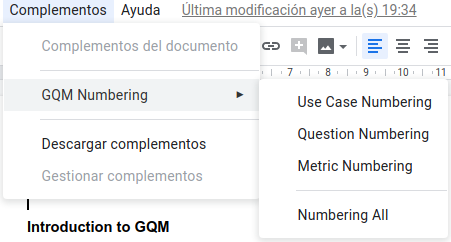

# GQM Numbering - Google Docs Add-on

This App Script tries to ease the task of numbering headers according
to [`Goal, Question, Metric` approach (GQM)](https://en.wikipedia.org/wiki/GQM)

This add-on adds a numbered 'prefix' to the specified 'heading' texts. By
default (and still not configurable) the headings are:
* `HEADING2` -> `UCn.` for use case numbering.
* `HEADING4` -> `Qn.` for question numbering.
* `HEADING5` -> `Mn.` for metric numbering.

**Please don't use tabs in titles**, they are used to separate and identify 
the numbered prefixes.

## Features
 * Numbering relative to the corresponding heading, not to others.
   This allows to have a unique number for each question, no matter where
   the question is nested.
 * Prefixes are included as part of the title text. This way they will also
   appear in the table of contents (different from standard numbering
   currently supported on Google docs).
 * Supports using the same number for the same title: if the same title is 
   used several times with the same heading, then this function will assign 
   the same numbered prefix to all its occurences.  

## How to use it
Once the script is stored in your account or associated to a document you should
be able to see it on the top menu:

You can number each heading separately or all together, it's up to you in case
you don't need to number any of the headings.

If you need to install it, please read [`How to install it`](#how-to-install-it) 
section.

## How to install it

### Manual installation
Currently you need to manually add the script to your document. Please find
below a summary of the steps needed to do so, compiled from 
[the quickstart example provided in the official documentation](https://developers.google.com/gsuite/add-ons/editors/docs/quickstart/translate#translate.gs):
* Select the menu item `Tools > Script editor`. If you are presented with a
welcome screen, click `Blank Project`.
* Delete any code in the script editor and rename `Code.gs` to `gqm_numbering.js`.
* Paste the contents of 
[gqm_numbering.js script](https://github.com/alpgarcia/gqm-numbering/blob/master/gqm_numbering.js).
* Select the menu item `File > Save all`. Name your new script `GQM Numbering` and click `OK`.
* Switch back to your document and reload the page. After a few seconds, a `GQM Numbering` sub-menu
  will appear under the Add-ons menu. 

### Using clasp

Please see [clasp documentation](https://developers.google.com/apps-script/guides/clasp).

## Acknowledgements
Base code borrowed from https://webapps.stackexchange.com/a/46905
